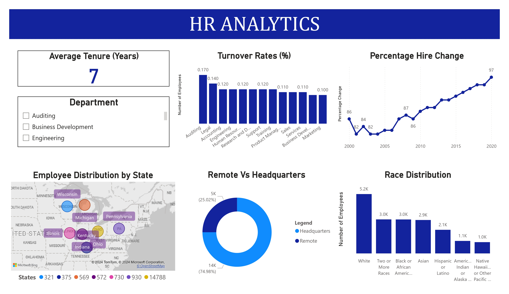
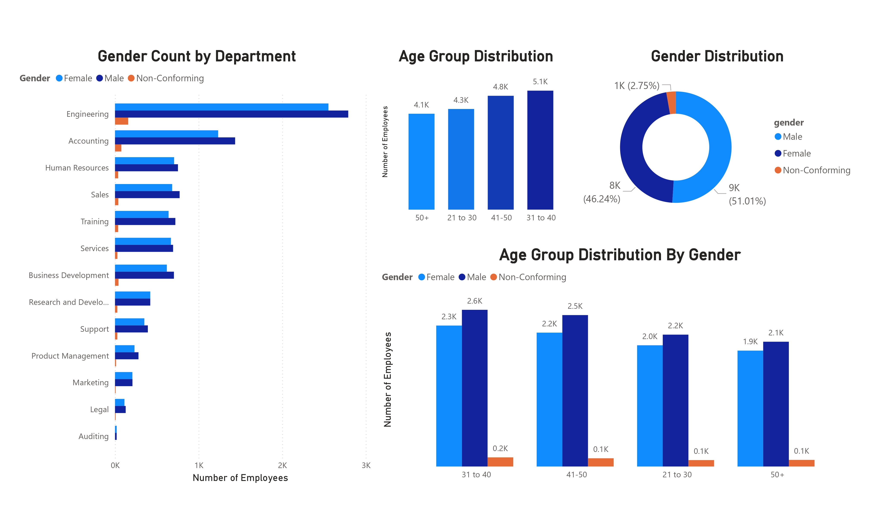

# HR Analytics with SQL and Power BI

## Table of Contents

- [Project Background](#project-background)
- [Data Source, North Star Metrics, and Dimensions](#data-source-north-star-metrics-and-dimensions)
- [Executive Summary](#executive-summary)
- [Insights Deep Dive](#insights-deep-dive)
- [Recommendations](#recommendations)
- [Assumptions and Caveats](#assumptions-and-caveats)

## Project Background

This HR Analytics project is an end-to-end analysis conducted to gain insights into employee demographics, turnover rates, and workforce diversity within a hypothetical organization. The project leverages a dataset consisting of 22,214 employee records, using SQL for data manipulation and Microsoft Power BI for visualizations. The primary goal of this analysis is to help HR departments make data-driven decisions regarding employee retention, diversity, and workforce planning.

## Data Source, North Star Metrics, and Dimensions

### Data Source:

- The dataset used for this analysis contains 22,214 rows and includes various employee attributes such as age, gender, race, department, job title, location, hire date, and termination date.
- [Link to dataset](https://www.kaggle.com/datasets/priykushwaha/hr-dataset)

### North Star Metrics:

The key metrics that drive the analysis are:

- **Turnover Rate**: The percentage of employees leaving the company relative to the total workforce.
- **Employee Distribution**: The breakdown of employees across states, departments, and job titles.
- **Tenure**: The average length of employment for the company's staff.

### Data Dimensions:

- **Demographics**: Gender, Age, Race
- **Workforce**: Department, Job Title, Location
- **Time**: Hire Date, Termination Date (new_termdate)

## Executive Summary

This HR analytics project identified key workforce trends, such as a predominance of employees in certain age groups (31–40 years), a relatively balanced gender distribution, and varying turnover rates across departments. The data reveals that certain departments like Auditing and Legal have the highest turnover rates, while the average employee tenure is approximately seven years. These insights provide valuable context for HR strategies related to recruitment, retention, and diversity initiatives.

## Insights Deep Dive

### Key Insights:

- **Age Distribution**: The majority of employees fall within the 31–40 age group, with a fairly even distribution across other age ranges.
- **Gender Breakdown**: The workforce is nearly evenly split between male (51.01%) and female (46.24%) employees, with a small percentage of non-conforming gender identities.
- **Race Distribution**: The workforce is predominantly White (5.2K employees), followed by Two or More Races, Black or African American, and Asian employees.
- **Turnover Rates**: The Auditing department has the highest turnover rate, with approximately 17% of its workforce leaving the company.
- **Remote vs. Headquarters**: About 75% of employees are based at the company’s headquarters, while the remaining 25% work remotely.

## Recommendations

Based on the insights drawn from the analysis, the following recommendations are made:

- **Improve Retention in High-Turnover Departments**: Auditing and Legal departments have high turnover rates. HR should investigate underlying causes, such as job satisfaction and workload, and implement retention strategies.
- **Diversity and Inclusion Initiatives**: While the company has a reasonably diverse workforce, it can improve inclusion by ensuring representation across all departments and implementing bias-free recruitment practices.
- **Support for Remote Workers**: As a significant portion of employees work remotely, HR should focus on enhancing communication, team engagement, and development opportunities for remote staff.

## Assumptions and Caveats

- **Data Assumptions**: It is assumed that the dataset represents the complete workforce and that the "new_termdate" accurately reflects employee termination dates.
- **Caveats**: The analysis is limited to the columns available in the dataset. Additional context, such as employee performance or satisfaction scores, would provide a more comprehensive view of workforce dynamics. 
